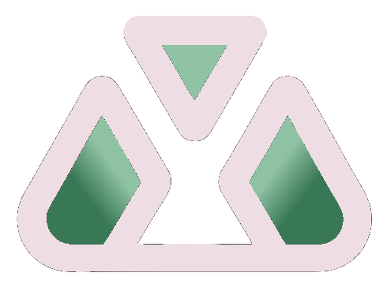

<a id="top"></a>
#  Tikal
Sistema de Gestión de tareas con registro de Tiempo para Proyectos.

## Índice
- [Problemática principal](#problemática-principal)
- [Solución propuesta](#solución-propuesta)
    - [Desarrollo de los diferentes puntos](#desarrollo-de-los-diferentes-puntos)
- [Requisitos Funcionales y no Funcionalese para Tikal](#requisitos-funcionales-y-no-funcionalese-para-tikal)
    - [Requisitos Funcionales](#requisitos-funcionales)
    - [Requisitos no Funcionales](#requisitos-no-funcionales)
- [Aplicaciones similares y diferencias con Tikal](#aplicaciones-similares-y-diferenciacias-con-tikal)
    - [Innovaciones exclusivas de Tikal](#innovaciones-exclusivas-de-tikal)
    - [Diferencias de otras empresas con Tikal](#diferencias-de-otras-empresas-con-tikal-desarrolladas)
- [Preguntas al profesor](#preguntas-al-profesor)
- [Perfiles y flujos](#perfiles-y-flujos)
- [Aplicación mínima viable](#aplicación-mínima-viable)
- [Bases académicas de estudio](#bases-académicas-de-estudio)
    - [Estudio sobre el burnout y como se produce](#estudio-sobre-el-burnout-y-como-se-produce)
    - [Como medir el estres con weareables](#como-medir-el-estres-con-weareables)
- [Estructura de GitHub](#estructura-de-github)
- [Equipo de trabajo](#equipo-de-trabajo)
- [Tecnologías utilizadas](#tecnologías-utilizadas)

## Problemática principal
Los usuarios que gestionan proyectos (estudiantes, freelancers, equipos) deben usar aplicaciones separadas para organizar tareas (ej: Trello) y registrar tiempo (ej: Toggl), lo que genera fragmentación de datos y pérdida de productividad.

- No es posible asociar automáticamente el tiempo invertido a tareas específicas.
- Falta de dashboards unificados que muestren el progreso del proyecto y el tiempo por actividad.

## Solución propuesta

1) **Automatización inteligente**: Otras apps requieren acciones manuales para registrar tiempos. Tikal podría detectar automáticamente cuándo estás trabajando en una tarea mediante IA (sin activar timer manualmente).

```
2) **Predicciones útiles**: Ninguna competencia usa datos históricos para mejorar la planificación. Tikal podría aprender de tus hábitos y sugerir tiempos realistas.
```

3) **Bienestar integrado**: Las apps de productividad suelen olvidar el factor humano. Aquí hay espacio para innovar con descansos inteligentes y prevención de burnout.

4) **Integración Contextual de Subtareas**: timer independiente para cada subtarea, Tiempo total = Σ subtareas + tiempo adicional en tarea padre.

5) **Enfoque cultural**: diseño inspirado en la cultura maya (paleta de colores, iconografía).

6) **Tecnología unificada**: mismo bakcend para móvil y web, con sincronización en tiempo real.

7) **Vinculación con otras plataformas**: poder vincular proyectos a por ejemplo a github o gitlab.

8) **Modo templo**: modo para concentrarse sin ninguna distracción, el usuario selecciona las tareas para la sesión.

9) **Sistema de evaluación de calidad**: al marcar la tarea como completada aparece un pop-up con la pregunta de calidad del resultado.


### Desarrollo de los diferentes puntos
**Para la automatización**, un sistema que:
- Use el sensor de movimiento del móvil para detectar actividad laboral

- Analice patrones de tecleo en la versión desktop

- Sugiera automáticamente tareas en curso basándose en tu ubicación (ej: si estás en la biblioteca, sugiere continuar con el estudio de X materia)

*Ejemplo: Detectamos que estás escribiendo en Word, la aplicación sugiere: ¿Iniciar timer para 'Documentación TFG'?*

```
**Predicciones útiles**:

- Un algoritmo que compare tu estimación inicial con el tiempo real empleado

- Que genere alertas cuando una tarea supera sistemáticamente lo planeado

- Que ajuste automáticamente futuras estimaciones basándose en tu rendimiento histórico

En resumen el algoritmo analiza el historial para ajustar estimaciones y sugerir el tiempo que te podría llevar a realizar la tarea.

*Ejemplo: Completaste tareas similares en 2h (promedio). ¿Asignar 2.5h por seguridad?*
```

**Para bienestar**:

- Un "termómetro de fatiga" que analice tu ritmo de trabajo (pausas, horas continuadas, nocturnidad)

- Sugerencias de descanso personalizadas

- Integración con wearables para medir [estrés fisiológico](#como-medir-el-estres-con-weareables).

**Modo templo**

- Bloqueo de aplicaciones no deseadas (configurable). 
- Bloqueo de notificaciones si el usuario lo requiere (O mostrar de una forma diferente).
- Sistema de recompensas, completar sesiones desbloquea artefactos.
- Altar virtual: Espacio donde se exhiben artefactos ganados, con datos de productividad (ej: "Has ganado 15h de enfoque puro").


Estas funcionalidades tendrían [base académica sólida](#bases-académicas-de-estudio):

- Papers sobre detección de actividad mediante sensores (IEEE).

- Estudios de planificación con machine learning (ej: modelos ARIMA).

- Investigación sobre prevención del síndrome de [burnout](#estudio-sobre-el-burnout-y-como-se-produce).

Alertas de ineficiencia:

- Clave para proyectos de software ya que notifica si el ritmo de trabajo no alcanza para completar la tarea en el tiempo estimado.
- Ej: *"Vas al 40% del progreso con el 70% del tiempo consumido. ¿Revisar prioridades?"*

<p align="right">
    <a href="#top">⬆️ volver arriba</a>
</p>

---

## Requisitos Funcionales y no Funcionalese para Tikal

### Requisitos Funcionales

**A. Gestión de Usuarios**

1. Registro/Autenticación:
    - RF1: Registro con email y contraseña.
    - RF2: Selección de perfil (Indeependiente/Cooperativo) durante onboarding.
2. Perfil de Usuario:
    - RF3: Personalización de avatar tema (desbloqueables con logros).
    - RF4: Conmutador entre perfiles (puede cambiar entre el cooperativo y el independiente).

**B. Perfil Independiente**

3. Listas y Tareas:
    - RF5: creación de listas con anidación de hasta ¿4/3? niveles *(Proyecto → Fase → Tarea → Subtarea)*.
    - RF6: asignación de tiempo estimado por lista/tarea (opcional).
    - RF7: timer manual/automático (al completar tarea).
    - RF8: campos opcionales: descripción + enlace a GitHub (con rama específica), además de la asígnación de ganancias o dinero que generas con cierta tarea.
4. Integración con GitHub:
    - RF9: Análisis de commits en la rama especificada y el tiempo de la tarea en función de estos.
5. Modo templo:
    - RF10: Activación con bloqueo de notificaciones y aplicaciones (en movil) y sonidos ambientales
    - RF11: asignación de tareas a concentrarse en el modo templo.
    - RF12: opción de entrar en modo templo con cronometro o poniendo un tiempo de cuanto quieres estar concentrado.
    - RF13: desbloqueo de temas y trofeos según las horas concentrado.
    - RF14: al terminar el modo templo si se han introducido más de una tarea que se quería hacer en modo templo, al final se preguntará el porcentaje de tiempo que se le ha dedicado a cada una. Además se preguntará si las tareas se han terminado o no (si hay una o más tareas).
6. Sistema de logros:
    - RF15: Glifos desbloqueables por horas acumuladas (*ej: 4h = Imix, 8h = kawak*).
    - RF16: Estos trofeos se quedarán un altar de trofeos.
7. Estadíticas:
    - RF17: gráfico de efectividad (Tiempo estimado vs. tiempo real por tarea).
    - RF18: Reporte semanal de productividad, podrás ver a que le dedicas más tiempo tanto semanal como diariamente para así minimizar distracciones.

**C. Perfil Cooperativo**

8. Gestión colaborativa:
    - RF19: creación de listas compartidas (solo administrador).
    - RF20: invitación de usuarios por email (sistema de roles en las invitaciones).
    - RF21: Permisos diferenciados:
        - Admin: editar/eliminar listas, asignar tareas.
        - Colaborador: añadir subtareas, registrar tiempo en tareas asignadas.
9. Sistema de logros públicos:
    - RF22: trofeos visibles para el equipo.
    - RF23: tablero de líderes por metricas como eficiencia o trofeos.
10. Fatiga laboral:
    - RF24: Termometro de fatiga basado en horas trabajadas y datos de wearables (integración con APIs de Fitbit/Apple Health).
    - RF25: Alertas personalizadas (*ej: "Nivel de fatiga: Alto. Sugerimos pausa"*).
    - Fatiga = (Horas_trabajadas × 0.7) + (Ritmo_cardíaco_promedio × 0.3)

**D. Comunes a ambos perfiles**

11. Sincronizacción:
    - RF26: sincronización en tiempo real móvil - web.
12. Exportación:
    - RF27: Reportes exportables a PDF/CSV (estadísticas, tiempo por proyecto...).
13. Automatización inteligente:
    - RF28: Detección automática de actividad en escritorio.
        - El sistema monitorea aplicaciones activas (Word, Excel, VS Code, etc.) cuando el usuario lo autoriza.
        - Al detectar actividad relevante (ej: usuario escribe en Word >30 seg), sugiere iniciar timer para tareas relacionadas.
    - RF29: Asociación contextual tarea-aplicación.
        - El usuario puede vincular tareas con Aplicaciones específicas (*ej: tarea "Programar API" → VS Code*) o con palabras clave en títulos de ventana/archivos (*ej: "Informe.pdf" → tarea "Revisar documentos"*).
    - RF30: tienes diferentes opciones al recibir la sugerencia: Iniciar timer para tarea sugerida, seleccionar otra tarea de la lista o registrar el tiempo manualmente.
    - RF31: aprendizaje progresivo:
        - Elecciones previas del usuario (ej: si siempre ignora sugerencias para "Reuniones", deja de proponerlas).
        - Patrones horarios (ej: si programa entre 10:00-14:00, prioriza tareas técnicas en ese lapso).
14. Sistema de logros comunes:
    - RF32: cuando el usuario desbloquea diferentes glifos también conseguirá nuevos temas que pueden cambiar tu foto de perfil o tu UI.

### Requisitos no funcionales

**A. Usabiliddad**
1. RNF1: interfaz intuitiva inspirada en cultura maya (iconografía, paleta).
2. RNF2: Curva de aprendizaje < 10 min (guía interactiva en onboarding).

**B. Seguridad**

3. RNF5: Encriptación AES-256 para datos sensibles.
4. RNF6: Autenticación JWT + OAuth 2.0 para integraciones.

**C. Escalabilidad**

5. RNF7: Arquitectura con microservicios.
6. RNF8: Bases de datos replicables (PostgreSQL para relaciones, Redis para caché).

**D. Integraciones**

7. RNF11: API REST para:
    - GitHub (webhooks para análisis de commits).
    - Wearables (Fitbit/Apple Health usando OAuth)

**E. Automatizacion**

8. RNF12: Privacidad estricta
    - Todos los datos de actividad se procesan localmente (nunca en servidores externos).
    - Opción de desactivar monitoreo en ajustes.
9. RNF13: Eficiencia en recursos
    - Consumo CPU < 3% en segundo plano.
    - Muestreo de actividad cada 2 min (no constante).

<p align="right">
    <a href="#top">⬆️ volver arriba</a>
</p>

---

## Aplicaciones similares y diferenciacias con Tikal

| Aplicación | Funcionalidad principal | Limitaciones vs Tikal |
|------------|-------------------------|-----------------------|
| Toggl Track | Timer manual, informes básicos | ❌ No tiene gestión integrada de tareas ni proyectos |
| Trello | Tableros Kanban, gestión visual | ❌ Timer no integrado, requiere plugins externos |
| Microsoft To Do | Listas simples, sincronización multiplataforma | ❌ Sin seguimiento de tiempo ni análisis |
| Asana | Gestión ágil, colaboración en equipos | ❌ Sin seguimiento de tiempo para subtareas |
| ClickUp | Plantillas personalizables, vistas múltiples | ❌ IA predictiva limitada, enfocada en organización |
| Jira | Gestión técnica (bugs, sprints) | ❌ Complejo para no-técnicos y sin timer integrado |
| ProofHub | Timer + gestión de proyectos | ❌ Sin evaluación de calidad ni métricas de eficiencia |
| Smartsheet | Hojas cálculo avanzadas, Gantt | ❌ Configuración manual intensiva, sin detección automática |
| OmniFocus | Listas simples, integración profunda con apple | ❌ Configuración manual intensiva, no permite temporizar las tareas |

### Innovaciones exclusivas de Tikal

|          Función           | Tikal | Competencia            |
|----------------------------|-------|------------------------|
| Timer automático por tarea |  ✅	|         ❌             |
| Predicción de tiempos (IA) |  ✅	| ❌ (ClickUp: limitado) |
| Evaluación de calidad	     |  ✅	|         ❌             |
| Bienestar integrado	     |  ✅	|         ❌             |
| Enfoque cultural           |	✅	|         ❌             |


### Diferencias de otras empresas con Tikal desarrolladas

**Toggl Track**
- Cosas en común: se puede hacer un tracking de tiempo de diferentes tareas/proyectos, se pueden hacer informaes de horas trabajadas y tiene integración con GitHub.
- Diferencias que aplica `Toggl Track`: tiene un enfoque exclusivo en tiempo, solo registra horas y no resultados.
- Diferencias que aplica `Tikal`: combina lista de tareas con el timer y estadísticas. Tiene trabajo colaborativo y sugerencias de tareas.

**ClickUp**
- Cosas en común: tiene diferentes espacios, donde guarda sus proyectos, listas de proyectos (hasta 7 nivelees de anidamiento). Tiene un registro manual/automático de horas. Tiene widgets para monitorizar carga de trabajo, o tiempo invertido. Integraciones con muchas herramientas como GitHub.
- Diferencias que aplica `ClickUp`: IA que responde preguntas sobre proyectos usando datos internos. Se interactua con lenguaje natural (chatbot). Tiene un chat para hablar con el resto del equipo sobre una determinada tarea.
- Diferencias que aplica `Tikal`: conexiones con weareables, con automatización del timer, bienestar integrado, sistema de logros y modo concentración.

**ProofHub**
- Cosas en común: getión de tareas y proyectos con listas y subtareas, timer manual para registro de tiempo, paneles básicos de estadísticas.
- Diferencias que aplica `ProofHub`:
    - Intormes básicos: limita análisis detallados de tiempo/calidad.
    - Personalización rígida: flujos de trabajo poco addaptables a metodologías ágiles.
    - Sin automatización: requiere activación manual del timer en cada tarea.
- Diferencias que aplica `Tikal`:
    - Timer inteligente; sugiere inicio automático según actiividad.
    - Dashboard predictivo: graficos de efectividad (tiempo estimado vs real) + correlación calidad/tiempo.
    - Modo templo: bloqueo de distracciones con narrativa maya y recompensas.

**OmniFocus**

- Cosas en común: puedes crear tareas y asignarles una fecha de finalización, se hará un recordatorio periodicamente sobre las tareas creadas.
- Diferencias que aplica `OmniFocus`: integración profunda con el ecosistema aple, combina tareas pendientes con eventos del calendario en una vista cronológica, optimizando la planificación diaria/semanal.
- Diferencias que aplica `Tikal`: la diferencia principal que tiene nuestra aplicación es la de que puedas contabilizar el tiempo que le has dedicado a cada tarea, además de que Tikal puede ser colaborativa y tiene estadísticas avanzadas.

<p align="right">
    <a href="#top">⬆️ volver arriba</a>
</p>

---

## Preguntas al profesor
- ¿Quitamos las predicciones utiles?
- ¿Chat con compañeros es factible?

---

## Perfiles y flujos
### 1. Persona "Freelance"

Necesita precisión en el registro de tiempo para facturación y análisis de rentabilidad por proyecto o tarea.

- *"Como freelance, quiero pausar el timer al cambiar de tarea sin perder datos"*: el timer inteligente pausa automáticamente al detectar inactividad prolongada y además existe un historial de intervalos registrados.

- *"Necesito facturas detalladas con hora/tareas para clientes"*: generación automática de reportes al exportar a PDF/csv, con desglose por tarea y tarifas personalizables.

- *"Quiero ver que proyectos/tareas son más rentables"*: dashboard "ROI" con la comparación de horas invertidas vs ingresos.

- *"Debo asociar tiempo registrado a commits especificos en GitHub"*: integración GitHub con una vinculación automática commit-tarea.

### 2. Estudiante

Necesidad central: Organizar múltiples asignaturas/proyectos manteniendo equilibrio estudio-descanso.

- *"Como estudiante, quiero dividir asignaturas y medir cuanto tiempo le dedicoa a cada una"*: se puede contabilizar el tiempo dedicado a cada asignatura con un timer, puedes luego ver las estadísticas (para ver por ejemplo la asignatura a la que más tiempo le dedicas) en el dashboard.

- *"Necesito apuntar las tareas que he de hacer en cada asignatura"*: se puede hacer dentro de cada proyecto (en este caso una asignatura), pudiendo dividir las listas de la siguiente forma: Asignatura → Tema → Tarea.

- *"Necesito recordatorios durante sesiones largas"*: en el modo templo sagrado puedes tener una notificación de descanso cada cierto tiempo (a determinar por el usuario).

- *"Quiero concentrarme durante 2horas estudiando el Tema 3 de Matemáticas"*: usar el modo templo puede restringir notficaciones y/o aplicaciones, según configuración del usuario.

- *"Me gustaría tener motivación para ponerme a estudiar"*: las recompensas impulsan al estudiante a ponerse a estudiar.

### 3. Compañía de desarrollo de software
Necesidad central: Gestión ágil de proyectos con métricas técnicas, colaboración en equipo y control de calidad.

**Desarrolladores del equipo**
- *"Como desarrollador, quiero vincular commits de GitHub a tareas automáticamente"*: auto-asociación commit-tarea usando ID en mensaje, tiempo invertido reflejado en el commit.

- *"Necesito alertas si una tarea consume más tiempo que lo estimado"*: notificaciones en tiempo real: "Tarea 'Fix Bug #42' lleva 120% del tiempo estimado".

- *"Quiero un timer que se pause automáticamente si detecta inactividad"*:Pausa tras 5 min sin teclear/mover mouse, resume al volver.

- *"Quiero optimizar el momento de mis tiempos de descanso"*: el termometro de burnout y las notificaciones de descanso ayudan a esto.

- *"Necesito motivación para ser más efectivo"*: impulso0 de efectividad y de motivación con el sistema de logros y trofeos.

- *"A veces se me olvida activar el timer al comenzar una tarea"*: las sugerencias inteligentes según la actividad del usuario resuelve este problema.

**Project Managers**

- *"Como PM, debo asignar tareas con prioridades y deadlines claras"*: el administrador de la lista compartida puede asignarle tareas a los integrantes y además asignar una fecha límite la que sea además del tiempo estimado que debería de tardarse en hacerla.

- *"Quiero ver el nivel de fatiga del equipo para evitar burnout"*: termómetro grupal, promedio de horas y estrés.

- *"Necesito ver quien tiene menos carga laboral para asignarle una tarea"*: se puede visualizar en la lista usuarios del proyecto.

- *"Necesito saber que hemos organizado mal para que este proyecto no salga bien"*: registro historico de datos sabiendo las tareas que se les ha dedicado más tiempo y las personas que se han dedicado a cada una. Pudiendo asignar más personal la proxima vez a tareas que se hayan visto más comprometidas o con más carga.

- *Puede haber un incentivo extra por parte de la empresa*: dias libres o subida salarial para el mejor de la liga de trabajadores.


<p align="right">
    <a href="#top">⬆️ volver arriba</a>
</p>

---

## Aplicación mínima viable

- Login/registro de usuario

- CRUD de proyectos (listas)

- CRUD de tareas dentro de cada proyecto

- Cronómetro por tarea: start / pause / stop

- Marcar tarea completada y guardar tiempo invertido

- Pantalla “Historial”: tabla simple de tareas + tiempo

Nombre de la aplicación ya buscado en [GoDaddy](https://www.godaddy.com/es-es/offers/godaddy?isc=sem3year&countryview=1&currencyType=EUR&cdtl=c_17954623671.g_142342359280.k_kwd-88659201.a_614893147180.d_c.ctv_g&bnb=b&gad_campaignid=17954623671) y en [namecheap](https://www.namecheap.com/).

Verificados también en Google Play y App Store.

<p align="right">
    <a href="#top">⬆️ volver arriba</a>
</p>

---

## Bases académicas de estudio

### Estudio sobre el burnout y como se produce
El **burnout** es un estado de agotamiento físico, emocional y mental crónico que surge debido al estrés laboral prologando no gestionado adecuadamente. Se caractertiza por tres dimensiones clave:
- Agotamiento: pérdida de energía física y mental.
- Cinismo/Despersonalización: actitudes negativas, irritabilidad y distanciamiento emocional.
- Reducción de la eficacia profesional: baja productividad, sensación de fracaso e insatisfacción.

Su aparición no es abrupta, sino que es un proceso acumulativo en el que tienen influencia varios factores.

**Factores desencadenantes**
 - *<u>Entorno laboral tóxico</u>*: sobrecarga de trabajo, falta de control sobre tareas, escaso recoocimiento, conflictos interpersonales, etc.
 - *<u>Desajuste persona-trabajo</u>*: expectativas irreales en comparación con la realidad laboral.

**Factores personales**
 - Perfeccionismo, baja autoestima o dificultad para gestionar emociones.
 - Escasas habilidades sociales o tendencia a la sobreimplicación. 

**Progresión de aparición del burnout**
 1. *<u>Entusiasmo inicial</u>*: Alta motivación e idealismo.  
 2. *<u>Estancamiento</u>*: Reducción de satisfacción.  
 3. *<u>Frustración crónica</u>*: Sentimientos de impotencia e irritabilidad.  
 4. *<u>Apatía</u>*: Desapego emocional y cinismo.  
 5. *<u>Burnout consolidado</u>*: Agotamiento severo y pérdida de funcionalidad.

**¿El estrés es un factor desencadenante?**

El burnout siempre proviene de un estrés laboral no resuelto. Sin embargo, no todo estrés deriva en burnout. Estas son las principales diferencias entre estrés y burnout.

|  Característica         |  Estrés                        |  Burnout                           |
|-------------------------|--------------------------------|------------------------------------|
|  Implicación emocional  |  Hipreactividad, ansiedad	   |  Desapego, cinismo                 |
|  Consecuencias          |  Físicas (Cefaleas, insomnio)  |  Emocionales (depresión, vacío)    |
|  Energía	              |  Agotamiento temporal	       |  Pérdida crónica de motivación     |
|  Riesgo principal	      |  Ansiedad	                   |  Depresión y pérdida de identidad  |

### Como medir el estres con weareables
Para llevar a cabo la medición del burnout a través de weareables, se pueden combinar las métricas de dichos dispositivos con otras laborales. Para ello se puede usar el siguiente enfoque multidimensional basado en envidencias científicas. 

| *Dimensión*             | *Indicadores Fisiológicos (Wearables)*           | *Métricas Laborales*                       | *Herramientas de Medición*                                |
|-------------------------|--------------------------------------------------|--------------------------------------------|-----------------------------------------------------------|
| *Agotamiento físico* | HRV nocturna < 50 ms<br> Sueño profundo < 1h 30min | Horas trabajadas/semana > 45h<br> Trabajo en fines de semana > 2 veces/mes | Oura Ring / Fitbit Sense<br> API de sistemas de horarios (ej: Calamari) |
| *Despersonalización* | Actividad física ↓ 30%<br> Interacciones sociales ↓ (geolocalización) |  Tasa respuesta emails > 4h<br> Ausencia en reuniones clave<br> Feedback negativo en encuestas | Apple Watch/Samsung Galaxy<br> Análisis de correos (ej: Microsoft Viva) |
| *Eficacia reducida*  | Deterioro patrones de sueño REM<br> HR elevada en reposo (>75 lpm)<br> "Body Battery" (Garmin) < 30/100 | KPIs incumplidos > 25%<br> Plazos incumplidos<br> Errores en tareas rutinarias | Garmin Venu 3<br> Integración con ERP (ej: SAP/Salesforce) |


<p align="right">
    <a href="#top">⬆️ volver arriba</a>
</p>

---

## Estructura de GitHub
Por ahora dispondremos las carpetas del proyecto tal que así:

```markdawn
Tikal/
├── .github/                  # Configuración CI/CD (workflows GitHub Actions)
│   ├── workflows/
│   │   ├── frontend-ci.yml
│   │   ├── backend-ci.yml
│   │   └── deploy-prod.yml
│
├── backend/                  # Servidor API
│   ├── src/
│   │   ├── controllers/      # Lógica de endpoints
│   │   ├── models/           # Schemas de base de datos
│   │   ├── routes/           # Definición de rutas
│   │   ├── services/         # Lógica de negocio (ej: cálculo tiempo)
│   │   ├── utils/            # Helpers (validación, encriptación)
│   │   └── server.js         # Punto de entrada
│   ├── .env                  # Variables de entorno
│   ├── Dockerfile
│   └── package.json
│
├── frontend/                 # Aplicación web/móvil
│   ├── public/               # Assets estáticos (favicon, index.html)
│   ├── src/
│   │   ├── components/       # Componentes reutilizables
│   │   │   └── charts/       # Gráficos personalizados (Sunburst, etc.)
│   │   ├── contexts/         # State management (React Context)
│   │   ├── pages/            # Vistas (Dashboard, Perfil, etc.)
│   │   ├── services/         # Conexión API
│   │   ├── styles/           # CSS/SCSS global + temas mayas
│   │   ├── App.jsx
│   │   └── main.jsx
│   ├── Dockerfile
│   ├── package.json
│   └── vite.config.js        # Configuración de compilación
│
├── ai/                       # Módulo de inteligencia artificial
│   ├── models/               # Modelos entrenados (ej: predicción de tiempo)
│   ├── scripts/
│   │   ├── train_model.py    # Script entrenamiento
│   │   └── predict.py        # Script para predicciones en producción
│   ├── requirements.txt
│   └── Dockerfile
│
├── docs/                     # Documentación
│   ├── arquitectura.md
│   ├── instalacion.md
│   └── endpoints-api.md
│
├── docker-compose.yml        # Orquestación de contenedores
└── README.md                 # Instrucciones globales
```

## Equipo de trabajo
<div align="center">

| [<br><sub>Fernado Osuna Granados</sub>](https://github.com/fog-3) | [<br><sub>Hugo Macías Jiménez</sub>](https://github.com/hugooomaciias) |
| :---: | :---: |
| fog-03@uma.es | hugo.macias.jimenez@uma.es |

</div>


## Tecnologías utilizadas

<p align="center">

</p>

<p align="right">
    <a href="#top">⬆️ volver arriba</a>
</p>

